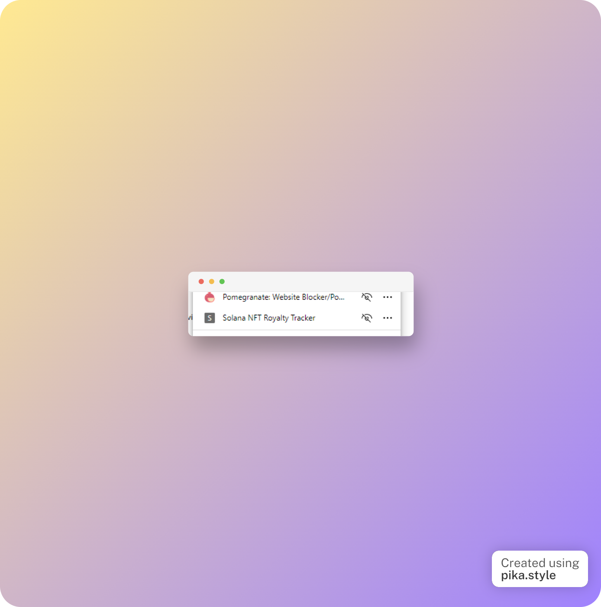

# Description

The NFT Royalty Browser Extension is a tool that allows
users to easily view Solana NFT royalties. With this extension,
users can easily see their NFT royalty
information, allowing them to track and manage their earnings from their NFT collections.
The extension is simple to install and use, and provides a convenient way for
NFT holders to stay on top of their royalty payments.
Additionally, the extension is fully compatible with the Solana blockchain,
ensuring smooth and seamless integration with users' existing NFT portfolios.
Overall, the NFT Royalty Browser Extension is a valuable tool for anyone who holds NFTs on
the Solana blockchain and wants to keep track of their royalty earnings.

# Supported NFT website

- https://magiceden.io
- https://solanart.io
- https://coralcube.io
- https://www.yawww.io
- https://opensea.io

# Video demo

# How to use

Solana browser extension for now can only be used on development mode as the chrome store is still not ready here is
a step by step on how to install it manually:

- first you need to clone this repository
- after that run in the command line `yarn` and continue with `yarn build`
- you will see a `dist` folder
- now open chrome or edge or whatever chromium based browser you have for example i use `edge` so i open it
by go to this url `edge://extensions`
- click on the `developer mode` switch if you haven't do that, like this:

- now click on load unpacked and you will go to your `dist` folder and click select folder

- you will then see something like this in your chrome extension if you're using edge click on the closed eye to show it in toolbar

- to use it now go to `https://magiceden.io/` and pick some NFT Collection

- now pick on one of the NFT

- now click our solana nft royalty tracker browser extension and let it run to check the royalty

- after its done it will show some of the information regarding last royalty that nft get like this:

- to see the detail and search for other nft click on search nft

- same as before let it run for a little while

- and you will see the detailed version of royalty tracker

